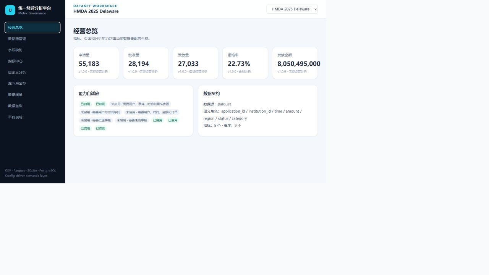
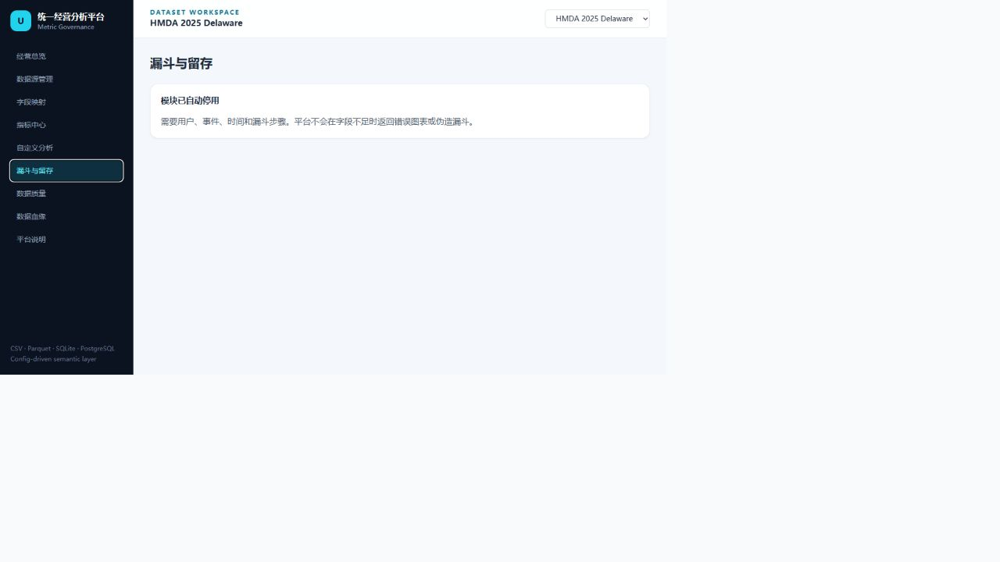
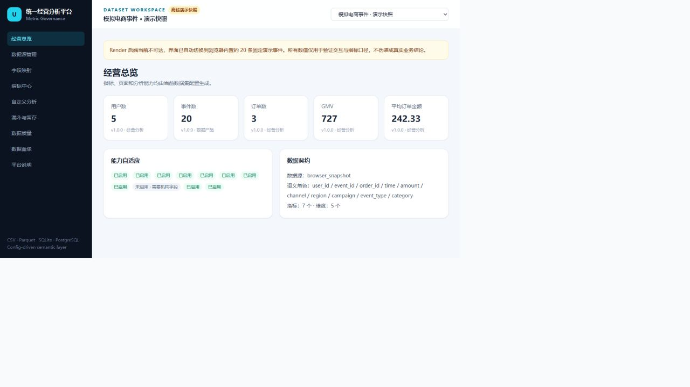

# 多数据源经营分析与指标治理平台

> Universal Business Analytics & Metric Governance Platform — 多数据源接入、字段语义映射、统一指标中心、安全动态查询、数据质量、血缘与经营看板。


| HMDA 真实指标工作区 | 缺少事件序列时自动停用漏斗 |
|---|---|
|  |  |

线上评审入口：<https://growth-intel-platform.vercel.app>。如果免费 Render 后端休眠或不可达，前端会自动切换到明确标注的 20 条浏览器内置演示快照，KPI、Schema、字段映射、自定义分析、漏斗、质量和血缘页面仍可完整评审；真实 HMDA 与 GA4 契约不会被演示值冒充。



## 业务问题

分析团队经常为每个数据源重新写连接、字段解释、指标 SQL 和看板，造成同名指标口径不一致、一次性分析难以复用、缺字段时页面报错。平台把流程沉淀为：注册数据源 → 读取 Schema → 映射业务角色 → 配置指标/维度/质量规则 → 后端安全生成查询 → 前端按能力动态展示。

## 数据来源与通用性验证

本地实际注册三套结构不同的数据：

1. 模拟电商事件：仓库内 20 行确定性演示数据，可独立运行。
2. GA4 契约：来自 `ga4-ecommerce-data-platform` 的标准 Parquet；当前本地联调使用明确标记的 20 行 fixture，正式 Google BigQuery 导出等待云登录，未冒充真实结果。
3. HMDA 契约：来自 `hmda-credit-analytics-platform` 的 2025 CFPB/FFIEC Delaware Snapshot，**55,183 条真实申请、558 家机构**。

同一 `/api/v1/datasets/{id}/metrics/{metric}` 接口已实际查询三套数据，同一轻量图表组件按任意白名单维度展示指标。HMDA 返回申请量 55,183、批准量 28,194、发放量 27,033、已决申请拒绝率 22.73%、发放金额 8,050,495,000 美元，与领域项目结果一致。

## 指标口径与安全语义层

数据集 YAML 保存指标中文名、公式/聚合、维度、默认过滤、负责人、版本和单位。查询引擎实际支持：

- count、distinct count、sum、average；
- ratio 与配置派生指标；
- 日/周/月时间粒度；
- 累计值与环比；
- 白名单维度下钻与参数化过滤。

前端不能提交任意 SQL。数据集和指标必须存在于注册中心，维度必须位于白名单，标识符经过正则校验，过滤值使用参数绑定。详情见 [`docs/METRIC_GOVERNANCE.md`](docs/METRIC_GOVERNANCE.md)。

## 数据接入与字段语义映射

统一 Adapter 接口提供连接测试、Schema、字段类型、预览和查询关系：

- CSV、Parquet：DuckDB 直接扫描；
- SQLite：Python 标准库读取 Schema/预览，并提供 DuckDB 执行关系；
- PostgreSQL：环境变量连接，读取 `information_schema`，不在配置中保存密码。

映射角色包括 user/event/order/application/institution/time/amount/channel/region/campaign/event_type/status/category。能力判定器根据映射自动启用或停用总览、趋势、漏斗、留存、RFM、渠道、活动、地区、机构和金额指标：HMDA 缺少用户事件时间序列，因此漏斗、留存和 RFM 会显示原因而不是报错。

## 数仓与数据加工

平台展示领域项目 ODS→DWD→DWS→ADS 血缘、节点依赖、指标来源和数据版本，但不重复实现调度器。GA4 与 HMDA 独立完成官方数据下载和领域加工，再通过 ZSTD Parquet 契约接入；三个仓库可独立运行。架构见 [`docs/ARCHITECTURE.md`](docs/ARCHITECTURE.md)，接入契约见 [`docs/DATA_CONTRACT.md`](docs/DATA_CONTRACT.md)。

## 数据质量

质量引擎根据每个数据集独立配置执行非空、条件非空、数值范围、枚举值域和唯一性；领域仓库继续负责更深的行数/金额对账、漏斗单调、缺失率、模型样本和新鲜度检查。平台本地联调三数据集各 3 条规则，9/9 通过；HMDA 领域项目另有 17 条真实规则（15 通过、2 警告、0 失败）。

## 产品交付

前端包含数据集切换、数据源管理、Schema/预览、字段映射、指标中心、经营总览、自定义分析、漏斗与留存、数据质量、血缘和平台说明。图表与 KPI 不写死业务数据；HMDA 和电商用同一页面组件。

核心 API：

```text
GET /api/v1/datasets
GET /api/v1/datasets/{id}/connection|schema|preview
GET /api/v1/datasets/{id}/metrics/{metric}?dimension=...&time_grain=...
GET /api/v1/datasets/{id}/quality|lineage|funnel
```

## 本地运行

```bash
# 后端
cd backend
python -m venv .venv
# Windows: .venv\Scripts\activate
# macOS/Linux: source .venv/bin/activate
pip install -r requirements.txt
python -m pytest
uvicorn app.main:app --port 8000

# 前端（另开终端）
cd frontend
npm ci
npm run lint
npm run build
npm run dev
```

导入领域契约：

```bash
python backend/scripts/import_contracts.py \
  --ga4 ../ga4-ecommerce-data-platform/data/platform/ga4_events.parquet \
  --hmda ../hmda-credit-analytics-platform/data/platform/hmda_applications.parquet
```

## 实际验收

- 后端 pytest：**18 passed / 0 failed**；包含三数据集注册、同一指标 API、安全维度、累计/环比、数据质量、漏斗顺序与能力自动关闭。
- 前端 lint：0 errors / 0 warnings；生产构建成功；轻量可访问图表无大体积依赖或 chunk 警告。
- 本地启动：FastAPI 8000 + Vite 5173 实际启动；浏览器验证数据集切换、真实 HMDA KPI、自动停用漏斗并保存截图。
- 数据质量：平台契约 9/9 passed；HMDA 领域项目 17 条 0 failed。
- Docker：保留部署入口，但本机未安装 Docker，因此没有伪称容器实跑通过。

## 项目限制

- GA4 正式 BigQuery 导出需要 Google Cloud 登录，当前平台中的 GA4 联调契约是明确标记的 fixture。
- PostgreSQL 需要调用者提供环境变量；未在公开仓库附带外部数据库凭据。
- 平台不是企业调度器，血缘是配置驱动的基础血缘；生产可对接 Airflow/dbt 元数据。
- 旧 MMM/LTV/流失/AI 报告代码保留作特定模板，但默认不挂载，也不声称通用于 HMDA。
- Render 免费后端目前返回 `hibernate-wake-error`；线上前端已提供透明且明确标注的数据快照降级。恢复后端后会自动优先使用 API，无需重新构建前端。

## 面试与简历材料

- [`docs/AUDIT.md`](docs/AUDIT.md)：旧仓库审计与重构决策
- [`docs/INTERVIEW_GUIDE.md`](docs/INTERVIEW_GUIDE.md)：架构、安全 SQL、指标治理与业务边界追问
- [`docs/RESUME_BULLETS.md`](docs/RESUME_BULLETS.md)：数据分析/BI、数据开发/数仓、央国企数字化三版
