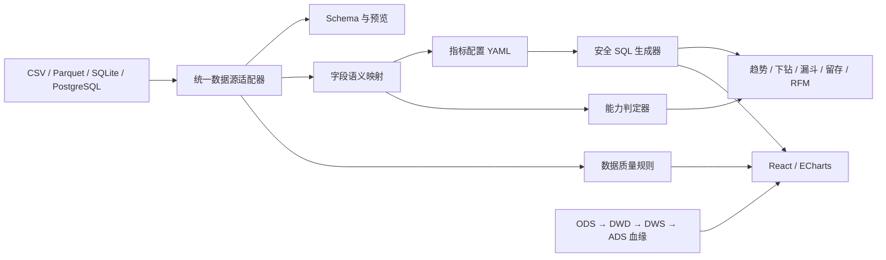

# 平台架构与技术选择

DuckDB 作为文件型数据的统一查询执行器，避免为 CSV 和 Parquet 各写一套业务逻辑；SQLite/PostgreSQL 适配器负责连接测试、Schema、表字段和预览。YAML 是版本化的数据集契约，包含数据源、字段角色、指标、维度、质量规则、血缘和版本。前端只提交数据集、指标、维度与粒度，不接收任意 SQL。

原仓库保留的模拟电商数仓与建模代码位于 `backend/app/services`，作为特定模板参考；通用平台运行入口已与旧的 MMM、LTV、流失和 AI 报告解耦，避免把它们包装成所有数据集都适用的能力。

